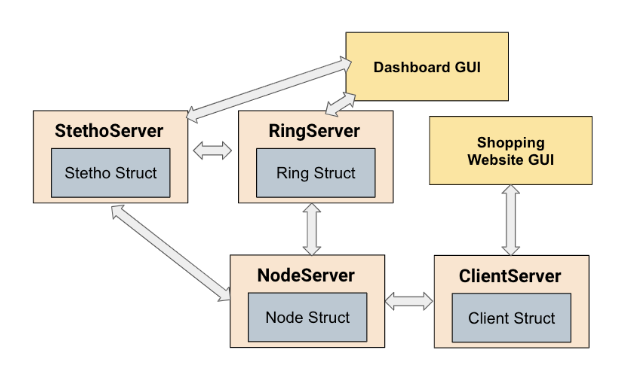
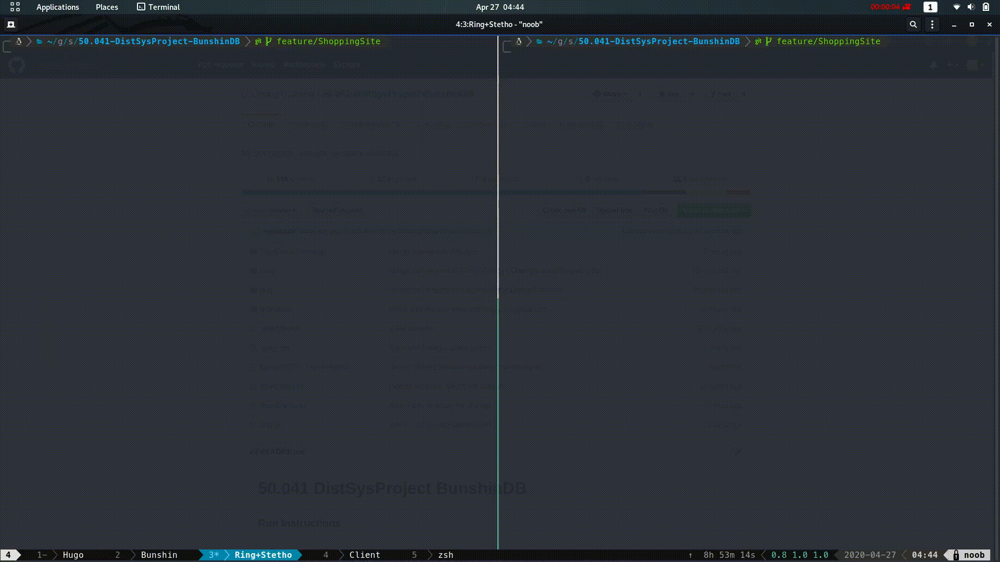
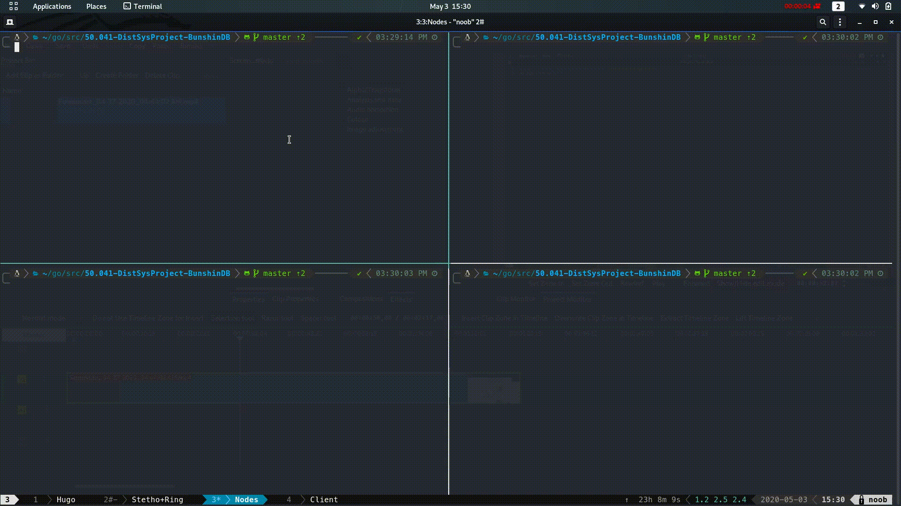
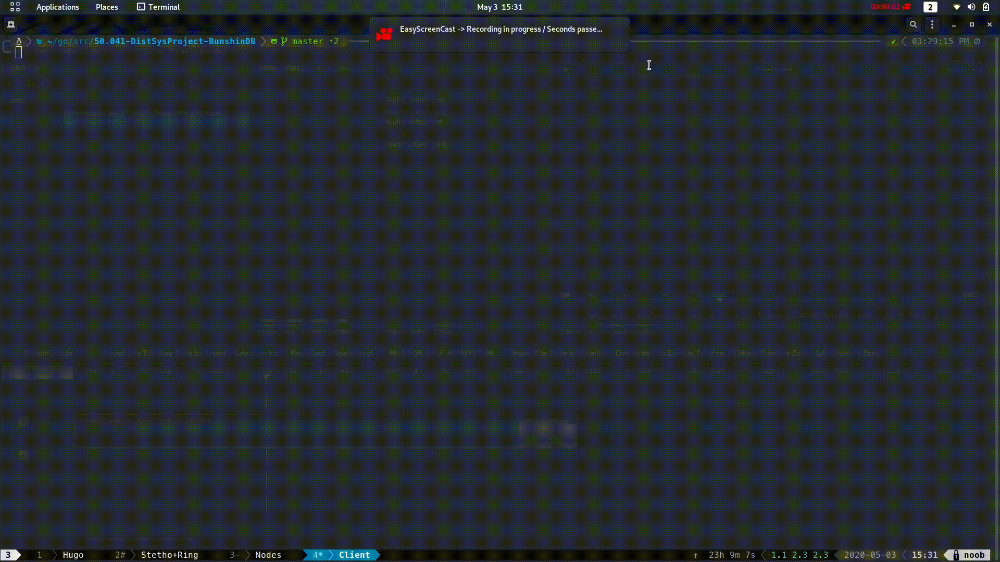
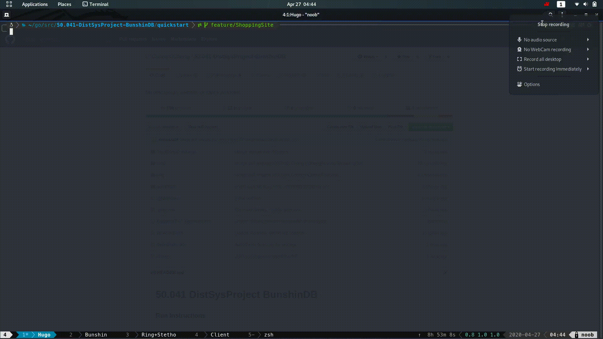

# 50.041 DistSysProject BunshinDB

### System architecture
#### Overview

<p align="center">
  
</p>

System Components:
1. Stethoscope Server -> Checks liveness of Ring Server and Node Servers
2. Ring Server -> Assign Node Servers different positions in the ring and ensures each node is aware of the hash ring
3. Node Servers -> Coordinates read and write requests based on their position on the ring and the hash of the key
4. Client -> Serves as the backend for the shopping website relays get and put requests from the users
5. Shopping Site -> Simple e-commerce web prototype
6. Dashboard GUI -> Visual overlay on the ring structure and the nodes' liveness status

### Features
* High availability of Reads and Writes
  * Even load distribution with Consistent Hashing
* Fast and consistent performance
  * Sloppy Quorum allows reads and writes operations to be completed without intermittent failures or congestion affecting the operations
* Fault tolerance
  * Nodes have a set of replicas based on their positions on the ring
  * In the case of temporary failures, data is stored temporarily by the replica and the replicas can serve the requests for the primary
  * In the case of permanent failures, the failed node is removed from the ring and at most K/N keys are reshuffled amongst the remaining N nodes.
* Horizontal scalability
  * Distributed Key Value database across different computers
* Eventually consistent
  * Data versioning with vector clocks ensures that items across different nodes will be up to date eventually

### Dependencies 
```cassandraql
Glog -> github.com/golang/glog
Badger -> github.com/dgraph-io/badger/
Hugo -> https://gohugo.io/
```

### Setting up pre requisites
```cassandraql
go get github.com/golang/glog
go get github.com/dgraph-io/badger/
brew install hugo
```

### Run Instructions 

Execution flow -> Stethoscope -> RingServer -> NodeServer(s) -> Client(s) -> FrontEnd

```cassandraql

#To run a stethoscope
go run cmd/stethoServer.go 

#To run a ringserver
go run cmd/ringServer.go 

```


```cassandraql

#To run a nodeServer
go run cmd/nodeServer.go <portNumber> <pathToDbFiles> <nodeId> <shouldRegister true|false> 

Note: The last argument, `shouldRegister` is either `"true"` or `"false"`. 
Set it to false if we want to simulate a revival of the node.  

```


```cassandraql

#To run a client 
go run cmd/client.go <portNumber> 

```



```cassandraql

#To run frontend

cd ShoppingSite
hugo server

```



#### Example Usage of Shopping Site:
After setting up hugo server, visit localhost:1313 on a web browser.

Shopping Cart data is stored in BunshinDB, easily save and update your shopping cart from any device.


#### Example Usage(CLI): 
To run a nodeServer
```cassandraq#
go run cmd/nodeServer.go 8080 /tmp/badger8080 1
help 
```
To run a client 
```cassandraql
go run cmd/client.go 9000
help 
```

Fault Detection 
```cassandraql
go run cmd/ringServer.go
go run cmd/stethoServer.go
go run cmd/nodeServer 8081 /tmp/badger8081 1 true 

```
